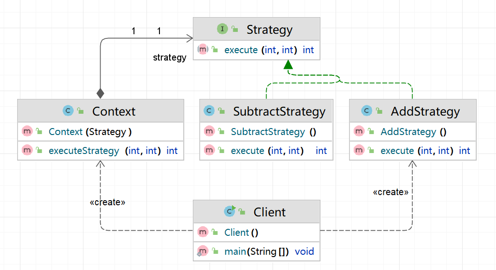
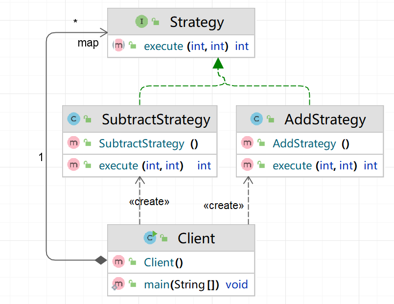
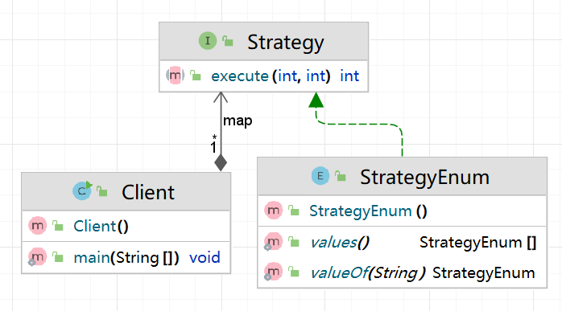

# 策略模式
这个策略模式是我第一个比较深刻认识到并运用到项目中的设计模式
## 基础
### UML类图

代码

```java
interface Strategy {
    int execute(int num1, int num2);
}

class AddStrategy implements Strategy {
    public int execute(int num1, int num2) {
        return num1 + num2;
    }
}

class SubtractStrategy implements Strategy {
    public int execute(int nums1, int nums2) {
        return nums1 - nums2;
    }
}

class Context {
    private Strategy strategy;
    public Context(Strategy strategy){
        this.strategy=strategy;
    }
    public int executeStrategy(int num1,int num2){
        return strategy.execute(num1,num2);
    }
}
```
## 进阶
1. 可以用一个map替代掉Context类

```java
import java.util.HashMap;
import java.util.Map;

interface Strategy {
    int execute(int num1, int num2);
}

class AddStrategy implements Strategy {
    public int execute(int num1, int num2) {
        return num1 + num2;
    }
}

class SubtractStrategy implements Strategy {
    public int execute(int nums1, int nums2) {
        return nums1 - nums2;
    }
}

class Client {
    private Map<String, Strategy> map;
    static {
        map = new HashMap<>();
        map.put("ADD", new AddStrategy());
        map.put("SUB", new SubtractStrategy());
    }

    public static void main(String[] args) {
        Strategy strategy=map.get("ADD");
        System.out.println(strategy.execute(10,100));
    }
}
```
2. 策略枚举解决策略类膨胀

```java
interface Strategy {
    int execute(int num1,int num2);
}
enum StrategyEnum{
    ADD_STRATEGY{
        @Override
        public int execute(int num1,int num2){
            return num1+num2;
        }
    },
    SUBTRACT_STRATEGY{
        @Override
        public int execute(int num1,int num2){
            return num1-num2;
        }
    }
}

class Client {
    private static Map<String,Strategy> map;
    static {
        map=new HashMap<>();
        map.put("ADD", StrategyEnum.ADD_STRATEGY);
        map.put("SUB", StrategyEnum.SUBTRACT_STRATEGY);
    }

    public static void main(String[] args) {
        Strategy strategy=map.get("ADD");
        System.out.println(strategy.execute(100,1));
    }
}
```
## 项目具体代码
```java
public class Server extends WebSocketServer {
    private Strategy strategy;
    private final Map<Integer, Function<Map<String, Object>, Strategy>>
            strategyMap= Collections.synchronizedMap(new HashMap<>());
    public Server(String ip,Integer port) throws Exception {
        super(new InetSocketAddress(ip,port));
    }
    private void initStrategy(){
        System.out.println("初始化策略");//使用了函数式编程
        strategyMap.put(LOGIN, LoginStrategy::new);
        strategyMap.put(REGISTER, RegisterStrategy::new);
        strategyMap.put(FIND_FRIEND, FindFriendsStrategy::new);
        strategyMap.put(FIND_USER, FindUsersStrategy::new);
        strategyMap.put(ADD_FRIEND_REQUEST, AddFriendRequestStrategy::new);
        strategyMap.put(REPLAY_REQUEST, ReplyAddFriendStrategy::new);
        strategyMap.put(INIT_CHAT, InitChatStrategy::new);
        strategyMap.put(SEND_MSG, SendMsgStrategy::new);
        strategyMap.put(DEL_FRIEND, DelFriendStrategy::new);
        strategyMap.put(INIT_UPLOAD_FILE,InitUploadFileStrategy::new);
        strategyMap.put(UPLOAD_FILE,UploadFileStrategy::new);
        strategyMap.put(REQUEST_NOTICE,InitNoticeStrategy::new);
        System.out.println("初始化策略完成");
    }
    private void setStrategy(Integer key,Map<String,Object> parameters){
        /*
         * Function<Map<String, Object>, Strategy>是Java 8引入的一个函数式接口，
         * 表示一个接受一个参数并返回一个结果的函数。在这个特定的上下文中：
         *  - 输入参数：Map<String, Object>，表示策略所需的参数集合。
         *  - 返回类型：Strategy，表示通过输入参数创建的策略对象。
         * 这允许将策略的创建逻辑以函数的形式存储在strategyMap中，从而可以在需要时动态地调用这些函数，
         * 生成相应的策略实例。这种方式提高了代码的灵活性和可扩展性。
         * */
        System.out.println("设置策略中：key="+key+"参数="+parameters.toString());
        Function<Map<String,Object>,Strategy> function=strategyMap.getOrDefault(key,params->{
            System.out.println("未找到策略！");
            return new Strategy() {
                @Override
                public Result execute() {
                    return null;
                }
            };
        });
        // 调用获取到的函数，传入parameters，并将返回的Strategy对象赋值给strategy变量。
        // 这样后续的操作可以使用这个策略进行执行。
        strategy=function.apply(parameters);
    }
    private Result doOperation(){
        if(strategy!=null){
            return strategy.execute();
        }else{
            System.out.println("未设置策略");
            return null;
        }
    }
    @Override
    public void onMessage(WebSocket webSocket, String s) {
        System.out.println("原始信息："+s);
        System.out.println("收到客户端 "+webSocket.getRemoteSocketAddress().getAddress()+
                ":"+webSocket.getRemoteSocketAddress().getPort()+" 发送过来的消息："+s);
        // 向客户端回馈消息
        Map<String,Object> parameters= Parser.getAttr(s);
        int key=Parser.getCategory(s);
        parameters.put("webSocket",webSocket);
        System.out.println("客户端请求的操作类型："+key);
        setStrategy(key,parameters);
        Result result=doOperation();
        // 打印信息
        if(result!=null){
            String response="type="+ CONST.RESPONSE+"&category="+key+"&"+result;
            System.out.println(response);
            webSocket.send(response);
            System.out.println("发送完毕"+response);
        }else {
            webSocket.send("客户端操作失败！");
        }
    }
    @Override
    public void onStart() {
        System.out.println("websocket服务端已启动");
        initStrategy();
    }
}
```