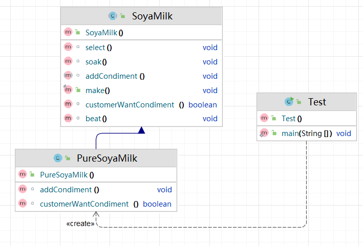

# 模板方法
在父类中定义了算法的骨架，并允许子类在不改变算法结构的前提下重定义算法的某些特定步骤。
## 类图


## 基础
实现方式
- 定义抽象父类：包含模板方法和一些抽象方法或具体方法。
- 实现子类：继承抽象父类并实现抽象方法，不改变算法结构。
```java
public abstract class AbstractClass{
    final void template(){//定义成final，防止被子类重写
        method1();
        method2();
        method3();
    }
    abstract void method1();
    abstract void method2();
    abstract void method3();
}
public class ConcreteClass extends AbstractClass{
    public void method1(){
        System.out.println(1);
    }
    public void method2(){
        System.out.println(2);
    }
    public void method3(){
        System.out.println(3);
    }
}
```

## 进阶
添加一个钩子方法可以微调算法结构
```java
public abstract class AbstractClass{
    final void template(){//定义成final，防止被子类重写
        method1();
        method2();
        if(func()){
            method3();
        }
    }
    abstract void method1();
    abstract void method2();
    abstract void method3();
    boolean func(){//默认是true
        return true;
    }
}

public class ConcreteClass extends AbstractClass{
    boolean func(){
        return false;
    }
    public void method1(){
        System.out.println(1);
    }
    public void method2(){
        System.out.println(2);
    }
    public void method3(){
        //不需要调用到method3，直接空实现
    }
}
```

## 优缺点
> 优点：
> - 算法的不变部分被封装的很好
> - 容易扩展
> - 易于维护

> 缺点：
> - 算法的一个实现就得增加一个子类，类太多
> - 可读性差